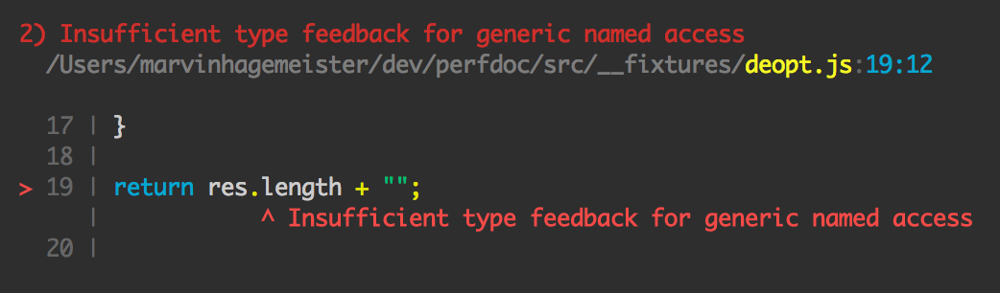
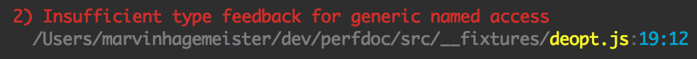

# perfdoc

Print V8 deoptimization reasons in a developer friendly way.

Example output:



Example output with `--short` flag:



## Usage

```bash
npm i -g perfdoc
```

and then run the script you want to analyze

```bash
perfdoc foo.js
```

## CLI

```txt
🔍  Print V8 deoptimization reasons in a developer friendly way

Usage:
  $ perfdoc [options] <file>

Options:
  --short      Hide code frame
  --bail       Exit with code 1 if a deoptimization has been found
  --help, -h   Show usage information and the options listed here

Examples:
  $ perfdoc foo.js
  $ perfdoc --short foo.js
  $ node --trace-deopt foo.js | perfdoc
```

## License

`MIT`, see [license file](./LICENSE.md).
